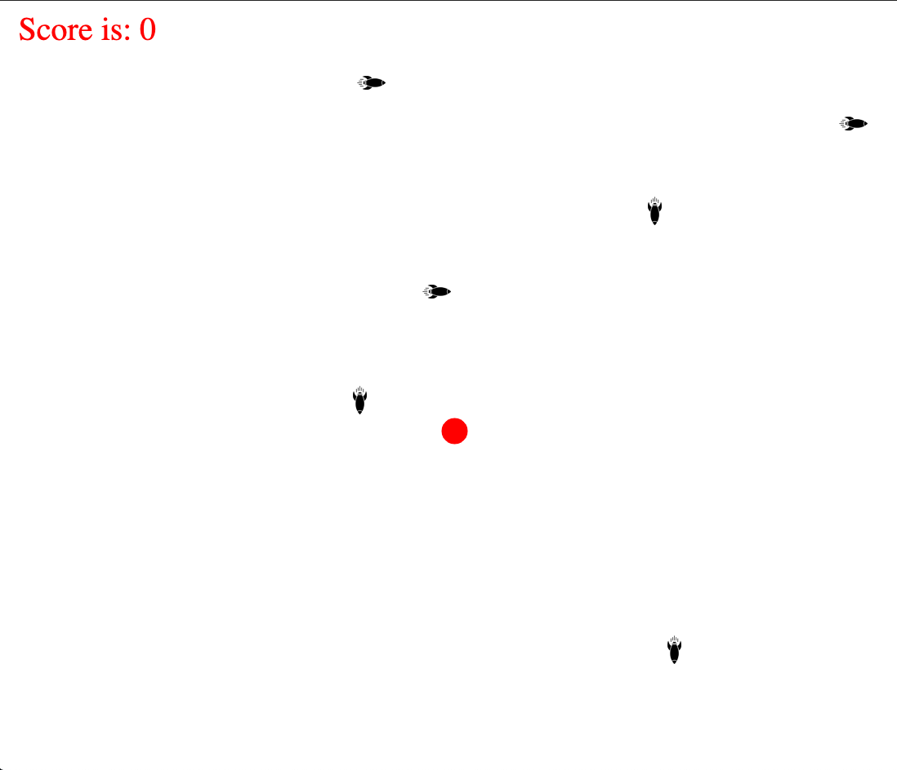

# Casustoets Object oriented programming

* Starttijd: 09:00 uur
* Eindtijd: 12:00 uur
* Studenten met een faciliteitenpas hebben recht op  20% extra tijd. Dat vertaalt zich voor dit tentamen naar 36 minuten. Deze studenten hebben dus een eindtijd van 12:36.
* Hulpmiddelen: internet, huiswerk en voorbeelden uit les. Je mag internet inzetten als een informatiemiddel maar niet als een communicatiemiddel.
* Eigenaarschap: de code die je hebt opgeleverd is door jou ontwikkeld.
* Je moet je gemaakte werk als ZIP-file inleveren via Learn.

## Casusomschrijving

Een vriend van je is pas aangenomen bij een software-ontwikkelbedrijf. Dit bedrijf wil zich beter in de markt zetten door het maken van serious games voor scholieren. Echter, niemand in het bedrijf heeft ervaring met het maken van games. Daarom is jouw vriend de opdracht gegeven uit te zoeken hoe game development werkt, een eerste game te bedenken en uit te werken. Dat is gelukt, en je vriend lijkt een game gemaakt te hebben die het bedrijf graag wil verkopen. Er moet alleen nog een aantal features worden toegevoegd. Maar daar had je vriend geen rekening mee gehouden. Elke poging om ook maar iets van functionaliteit aan de game toe te voegen mislukt hopeloos.

Gelukkig heb jij de cursus Object Oriented Programming gevolgd en kan jij wel bedenken wat hier aan de hand is. Je opent de code en inderdaad: vrijwel alles staat in één klasse waarin alles dus afhankelijk is van alles. Na een half uurtje tekenen en nadenken, ben je tot het volgende ontwerp gekomen.

Nu belt je vriend in paniek op: de game moet morgen af zijn. Hij belooft je de helft van zijn salaris als je kan helpen. Kun je het herontwerp implementeren en het scoresysteem gelijk toevoegen?

## De Game

"Rocket league" is een game waarin de speler (rode cirkel) rockets probeert te vermijden. Je kan de speler besturen met de pijltjestoetsen. Als je karakter een rocket raakt dan wordt de cirkel groter.

## Opdracht

Schrijf de gegeven code om volgens het gegeven klassediagram. Dit succesvol doen levert je maximaal 1 punt op voor beoordelingscriterium 4 en 6, en 0 punten voor beoordelingscriterium 8. Met andere woorden: het maximale cijfer is dan een 7,0.
Je kan de resterende punten halen door de volgende feature toe te voegen:

* Voeg een powerup toe aan het spel. Als de speler die powerup aanraakt, wordt de cirkel weer kleiner (maar nooit kleiner dan de startsituatie). Gebruik het klassediagram hieronder voor de implementatie van de powerup.

LET OP: het kan gebeuren dat je tijdens je implementatie andere keuzes maakt dan het klassediagram voorschrijft. Dat leidt – mits je uitwerking voldoet aan de beoordelingscriteria – niet tot een slechtere beoordeling.

## Tips

* Neem je tijd. Maak kleine wijzigingen en test ze allemaal voordat je een nieuwe wijziging maakt. Dan ben je altijd een enkele revert (ctrl + z) verwijderd van een werkende versie van je code als er onverwacht iets mis gaat.
* Begin met het implementeren van 1 klasse.
* Zorg er voor dat je code na implementatie van 1 klasse nog werkt en geen errors bevat.
* Implementeer vervolgens een volgende klasse en herhaal tot je alle klasses hebt.
* De methodes in het klassediagram hebben geen return type. Die zul je er dus zelf bij moeten zetten in je code!
* Constructoren, Getters en Setters zijn niet opgenomen in het class diagram. Deze kun je zelf toevoegen aan je code op basis van de class attributes.

## Inleveren

Je levert een zip-bestand in (geen rar oid) met daarin een je src map.

## Beoordelingscriteria

Nr | Leeropbrengsten | Punten
--- | --- | ---
1 | past op een consistente manier indentation in de code toe | 0,2
2 | voorziet de code volgens een standaard afspraak (AirBnB styleguide) code van commentaar | 0,4
3 | geeft consistent betekenisvolle namen aan variabelen, classes en methods (AirBnB styleguide) | 0,4
4 | structureert de code in classes met attributen en methoden | 2
5 | past overerving in de code toe om herhaling (code dublicatie) te voorkomen | 2
6 | geeft types van attributen, parameters en returnwaarden expliciet (any type is niet toegestaan) aan | 2
7 | past encapsulation (private, public or protected) in een class toe zodat data van de class op een goede manier wordt verborgen voor zijn omgeving | 1
8 | past polymorphisme toe opdat code minimaal wordt herhaald | 1
9 | past de DRY (Don't repeat yourself) principes toe zodat complexiteit van de code goed wordt verdeeld in onderhoudbare onderdelen | 1
