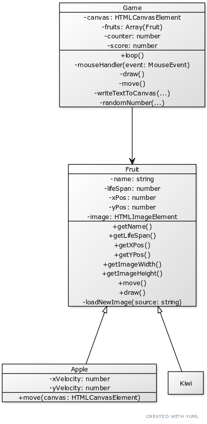

# Case study Object oriented programming

* Start: 09:00
* End: 12:00
* Some students are entitled to have some extra time. They all have 20% extra time, for this exam it is 36 minutes in total. You can hand the answers in until 12:36.
* Tools you are allowed to use: internet, homework assignments and examples from the course. You cannot use social media and you are not allowed to ask any anwers or code from your classmates.
* Ownership: the code you hand-in is written by you.
* You can hand-in your assignment via HZ Learn. Hand-in your project as a zip-file.

## Case

In this game the player tries to click on a Kiwi before it dissapears. If the player clicks on a kiwi, a point will be added to the total. But if the player clicks on an apple, a point will be subtracted from the total.

## Rules of the game

* One player game
* Kiwi's and apples disappear after some seconds
* Kiwi will gain one point
* Apple will cost one point
* After all kiwi's and apples are gone the game is over.

## Assignments

You will start with a working game. However all code is in one file and is not optimalised. It is your task to refactor the code by implementing the right classes, attributes and methods using this UML diagram.

Refactoring the code according to this class diagram will get you a maximum grade of 6,5. If you want to achieve a 10, implement the following rule (hints are already in the diagram):

* The apple should move across the screen in a random direction (it should bounce of the canvas boundaries)

## Tips

* Take your time. Make tiny changes and test every single one of them before making a new change. When something inadvertedly goes wrong, you're just one revert (ctrl + z) away from a working version of the code.
* Start with implementing one class.
* Before implementing the next class, make sure alle errors are resolved.
* Repeat until you have implemented all the classes.
* The class diagram doesn't show return types for the methods. You will need to add those in the code by yourself!

## hand in

Hand in a zip-file (no rar) of the src folder in your project.

## Criteria

Nr | Learning outcomes | Points
--- | --- | ---
1 | student applies indentation consistently for readable and structured code | 0,2
2 | student uses a standardize commenting style according to the AirBnB style guide | 0,4
3 | student naming styles for attributes, method and classes (alongside with variables and functions) is consistent and following the AirBnB style guide. | 0,4
4 | student applies classes (attributes and methods) to structure the code. | 2
5 | student applies inheritance to avoid code duplication | 2
6 | student adds types to attributes, parameters, return values explicitly. | 2
7 | student applies encapsulation in a class to hide the data and creates an interface for other objects. | 1
8 | student applies polymorphism to avoid redundancy. | 1
9 | student applies DRY principles to reduce complexity and stimulate readable and maintainable code parts. | 1
